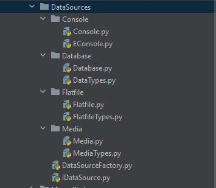
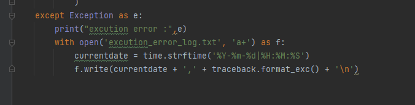

# Move_Detect_Birds
## We first built a small ETL module that contain:
##### first, we create folder DataSource That determine the input type ,we use enum that make the code more readable
* such as file like( Json,CSV,Html .....)
* or media like (MP4,MP3)
* or DataBase like (mssql,sqlite)

#### secondly, after determine type that we can use function extract,load:

- extract()

Which takes the path of the file or the connection string, do the magic, and return a Pandas `DataFrame` holding the data of that source.

- transform()

Which takes a Pandas `DataFrame` and a criteria dict and based on that criteria filters the data and return the result.

- load()

Which takes the the data as `DataFrame` also and the data destination you want (regardless of its type) and *append* the data into it. 

This covers a wide varaiety of syntax including (selecting and inserting); features include:

### **select**: 
 * Which extracts data according to some criteria and present them to the GUI.
 - example: `select * from [video::C:\Users\sheri\Downloads\birds4.mp4];`.
### **insert into**:
 - Which inserts the values you give into a data destination.
 - example: `select * from [video::C:\Users\sheri\Downloads\birds4.mp4] into [csv::C:\Users\sheri\Downloads\ETL-Compiler-main\ETL-Compiler-main\count_bird.csv];`.
 
Finally, we built a GUI window to work as an interface between the tool and the user, it gives the following layout:
 - **Input text box** for the SQL-like commands.
 - **Output text box** for the generated Python code.
 - **Results table** for showing the results if any.
 - **Compile Button** that compiles the commands you gave to Python.
 
  in compile we handle the error and return the exception in text file 

   
 
 
 - **Execute Button** that executes the Python code.
